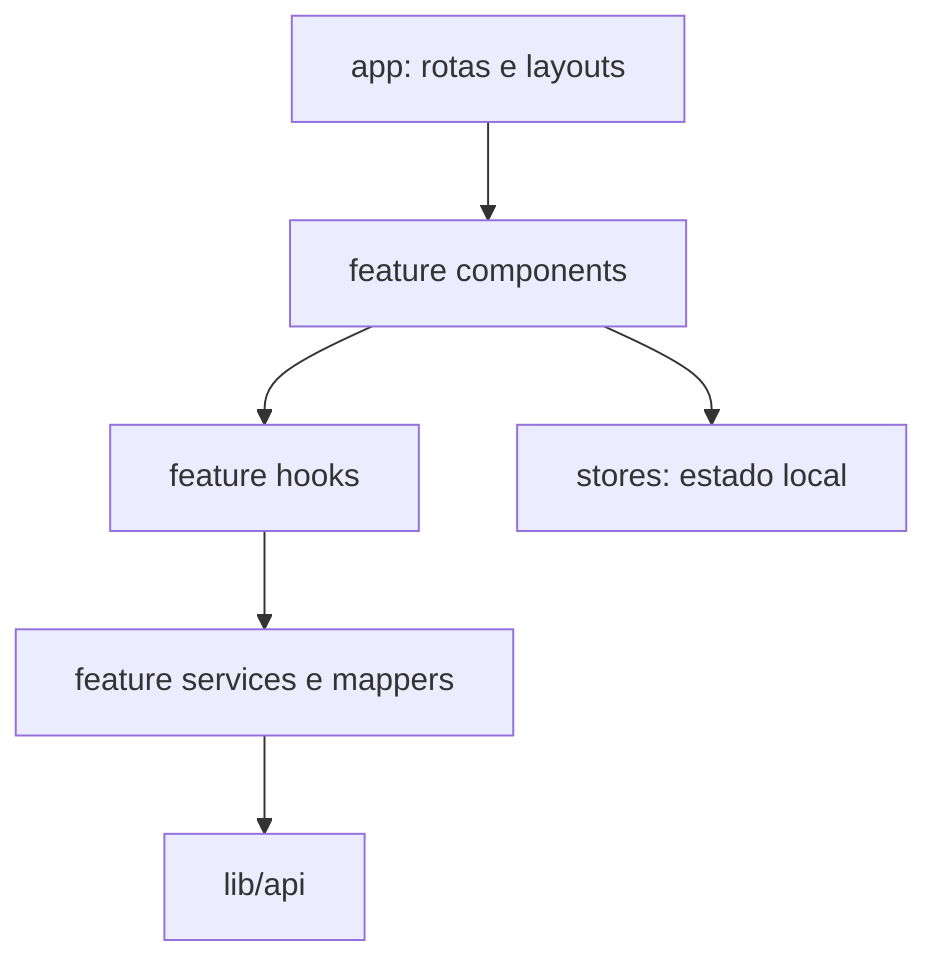

# Architecture Spine — Guardian of Bravantus

## Design Paradigm

**Layered feature modules.** `app/` compõe rotas e layouts; `features/<domínio>/components` apresenta e orquestra a interface; `hooks` coordena casos de uso, mutações e cache; `services` e mappers adaptam transporte para o domínio; `lib/api` concentra infraestrutura HTTP e React Query compartilhada. `components/` contém apresentação transversal e `stores/` somente estado local ou efêmero. A sessão fica atrás de uma fronteira única de autenticação; o armazenamento atual em Zustand/localStorage/cookie é legado, não contrato arquitetural.



As setas são a direção permitida. `lib/api` não depende de `features`; serviços não importam UI; estado local não contorna serviços para representar entidade remota.

## Invariants & Rules

### AD-1 — [ADOPTED] Módulos por feature em camadas

- **Binds:** `app/`, `features/`, `components/`, `lib/`, `stores/`; FR-1..FR-34.
- **Prevents:** regra de negócio em página, acesso HTTP em componente e dependência circular entre domínio e infraestrutura.
- **Rule:** rota/layout apenas compõe; UI chama hook; hook coordena service e cache; service/mappers convertem transporte; `lib/api` não importa `features`. Para revisão, `features/admin` pode depender de `features/mvp`; a direção inversa é proibida. Reuso neutro sobe para owner transversal explícito.

### AD-2 — Backend governa jornada e autoridade

- **Binds:** entrada, retomada, Builder, revisão, conclusão e operação; FR-1..FR-8, FR-11..FR-12, FR-19..FR-34.
- **Prevents:** rota inferida pelo cliente, permissão baseada em botão e regra/versionamento divergentes do servidor.
- **Rule:** `journeyState`, `nextRoute`, editabilidade, transições, autorização, limites e configuração versionada vêm do backend. `lib/campaign` normaliza a retomada e `lib/routing` decide `permitir | redirecionar | bloquear`; a UI não sintetiza estado canônico. Estado/rota ausente, desconhecido, `BLOCKED`, `LEGACY_REVIEW` ou loop termina em recuperação humana, nunca em avanço ou loader permanente.

### AD-3 — Estado remoto e local têm donos distintos

- **Binds:** todos os hooks, providers e stores; FR-2, FR-6..FR-7, FR-13, FR-20..FR-34.
- **Prevents:** duas verdades para campanha, Personagem, revisão, fila ou custo e retomada inconsistente entre dispositivos.
- **Rule:** React Query possui cache remoto; Zustand/localStorage contém apenas estado local/efêmero. A sessão é consumida por uma única fronteira de autenticação que governa middleware, cliente HTTP, logout e store; presença local nunca autoriza uma ação e o armazenamento legado atual não vincula a solução final.

### AD-4 — Transporte termina no service/mapper

- **Binds:** `features/*/services`, tipos de domínio e `lib/api`; FR-1..FR-34.
- **Prevents:** componentes interpretando envelopes, compatibilidade espalhada e mudanças de DTO quebrando telas de formas diferentes.
- **Rule:** todo contrato usado pelo `pilot-v1` tem validação runtime no limite externo e mapper explícito para envelope, opcionais, enum, erro e união de estado; valor desconhecido vira união/falha recuperável, nunca fallback silencioso. `as` sobre payload bruto não conta como mapeamento. Componentes e hooks consomem tipos de domínio e não acessam shape bruto da API.

### AD-5 — Mutação remota preserva coerência e idempotência

- **Binds:** participação, Rascunho, Pesquisa, submissão, revisão, artefatos e publicação; FR-3..FR-7, FR-13, FR-16, FR-19..FR-29, FR-32.
- **Prevents:** duplicação, navegação antes da persistência e cache contradizendo estado confirmado.
- **Rule:** toda mutação remota passa por service + hook; download de blob também usa essa fronteira. `features/mvp/query-topology.ts` possui a matriz tipada por transição para `myCharacter`, `characterById`, `resume`, `reviewQueue`, `operations`, Consentimento, Pesquisa, `builderConfig`, `cardArt`, publicação/elegibilidade e Perfil Público. Transição relê a retomada sem sintetizá-la. Estado decisório (`resume`, revisão e publicação) refaz leitura em mount/focus e ao detectar revisão diferente; invalidação local nunca presume atualizar outra sessão. Erro não avança. Repetição não duplica; até o OpenAPI fixar operação atômica ou chave de idempotência, histórias afetadas ficam bloqueadas.

### AD-6 — Identidade e configuração do Personagem são estáveis

- **Binds:** Builder, Ficha canônica, artefatos e legado; FR-7, FR-9..FR-14, FR-26..FR-29, FR-32.
- **Prevents:** uso de usuário/membership como Personagem, migração silenciosa e PATCH apagando capítulos válidos.
- **Rule:** `Character.id` é o único `characterId`; Personagem existente mantém sua `builderConfigVersion`; PATCH parcial omite valores vazios ou blocos inválidos e nunca os usa para limpar dados preservados. Versão indisponível vira recuperação somente leitura, sem fallback para a ativa; restauração exata ou migração backend versionada, auditável e confirmada pelo dono precede nova edição. `features/mvp/builder/character-presentation.ts` possui `CanonicalCharacterPresentation` e alimenta revisão, consulta, conclusão e o adaptador de PDF; nenhum consumidor redefine o shape. Perfil Público usa projeção separada.

### AD-7 — Revisão é concorrente, imutável e contextual

- **Binds:** submissão, pedido de ajustes e aprovação; FR-19..FR-23, FR-30..FR-32.
- **Prevents:** decisão sobre Rascunho mutável, sobrescrita de revisão nova, autorrevisão e confusão entre `ADMIN` e `MASTER`.
- **Rule:** `features/mvp` é o único owner de fila, detalhe, query keys e transições de revisão; Admin e Participante usam seus adaptadores. Submissão e decisão exigem Snapshot + `expectedRevision` ponta a ponta; `409` preserva edição local quando aplicável, invalida a topologia afetada e força ressincronização antes de nova ação. O contrato oficial devolve capabilities explícitas para visualizar, pedir ajustes e aprovar, com motivo de negação; nomes/shape vêm do OpenAPI. Backend valida papel, membership, autoria e atribuição; a UI não deriva ação sensível de papel local. `ADMIN` global não implica `MASTER`. Notificação é efeito observável e tolerante a falha: nunca reverte transição persistida.

### AD-8 — IA altera a Ficha somente após decisão humana

- **Binds:** IA assistiva e telemetria de IA; FR-15..FR-18, FR-33.
- **Prevents:** sugestão aplicada por efeito, decisão implícita, proposta parcial corrompendo a Ficha e indisponibilidade da IA bloqueando criação.
- **Rule:** gerar pode persistir sugestão, custo e proveniência, mas nunca altera a Ficha nem confirma decisão. O contrato oficial de decisão deve identificar geração/proposta, alvo, escolha humana, revisão original e valor efetivo quando aplicável; o frontend não inventa o DTO. Sugestão de campo persiste decisão antes do PATCH ou reverte/mantém local não persistível em erro. Proposta mecânica coleta decisões dos cinco blocos localmente e confirma tudo em uma operação backend atômica com `expectedRevision`; até existirem esses contratos no OpenAPI, aplicação de IA fica bloqueada. Falha, resposta parcial ou conflito mantém caminho manual e estado confirmado.

### AD-9 — Fronteiras de dados são allowlists por destinatário

- **Binds:** IA, Analytics, revisão, operação, Retrato, Carta, PDF, Perfil Público e Story; FR-15..FR-18, FR-20, FR-26..FR-31, FR-33.
- **Prevents:** reuso de payload privilegiado, vazamento de Segredo e minimização inconsistente entre superfícies.
- **Rule:** cada fronteira possui DTO próprio: IA recebe só contexto autorizado necessário; revisão recebe Snapshot autorizado; PDF local recebe a projeção canônica do dono; provedor visual recebe somente campos informados e necessários; Analytics/custo recebe metadados tipados; Perfil Público/Story recebe projeção pública mínima; funil recebe contagens/estado; lista operacional recebe identificação mínima; detalhe autorizado recebe Snapshot. `features/mvp/analytics-contract.ts` possui união fechada e versionada `eventKey → metadata`; nenhum evento ad hoc atravessa o service. Prompt integral, Segredo do Mestre, credencial, token e dado desnecessário são proibidos.

### AD-10 — Consentimento e publicação são ciclos versionados independentes

- **Binds:** Consentimento, Pesquisa Final, Perfil Público e Story; FR-3, FR-24, FR-28..FR-29.
- **Prevents:** aceite presumido, publicação derivada da aprovação, link público obsoleto e revogação sem efeito.
- **Rule:** `features/mvp/publication` é o único owner de estado, mapper, keys e transições de publicação; `features/characters` apenas apresenta a projeção pública. Aceite é versionado/auditável; mudança material exige reaceite; recusa não cria aceite; revogação bloqueia novas ações e despublica conforme política aprovada. Publicação é opt-in vinculado a `Character.id` + Snapshot aprovado. `CHANGES_REQUIRED` suspende o Perfil; nova submissão/aprovação, ou perda de Consentimento, aprovação, participação ou elegibilidade, invalida opt-in e caches controlados; recuperação exige novo opt-in. Story deriva apenas do mesmo Snapshot enquanto o Perfil está ativo.

### AD-11 — Artefatos são persistentes, explícitos e não transacionais

- **Binds:** Retrato, Carta Jogável, PDF e Story; FR-26..FR-29.
- **Prevents:** artefato efêmero, geração/publicação automática e falha periférica revertendo conclusão.
- **Rule:** Retrato e Carta têm disponibilidade, limite, proveniência e galeria persistente por variante governados pelo backend e só são gerados por ação explícita. Cada `ArtifactRef` contém `artifactId`, `characterId`, `sourceSnapshotId`, `variant`, `status`, proveniência e criação; Perfil/Story só selecionam o Snapshot publicado. PDF da Conclusão usa o Snapshot submetido e, após aprovação, o Snapshot aprovado; prévia de Rascunho, se existir, é capability/rótulo distinto. Falha, retry ou cancelamento não altera Ficha, aprovação ou conclusão.

## Consistency Conventions

| Concern | Convention |
| --- | --- |
| Módulos e arquivos | Domínio em `features/<domínio>/`; apresentação em `components/`; coordenação em `hooks/`; transporte em `services/`. Reuso transversal só sobe para `components/` ou `lib/` quando não pertence a uma feature. |
| Identidade e versão | Usar `Character.id` como `characterId`, `builderConfigVersion` do Personagem existente e `expectedRevision` nas transições concorrentes. |
| Dados e envelopes | Schema de transporte vive ao lado do service owner; schema compartilhado de domínio vive no owner nominal, nunca em `types/` genérico sem responsável. Mapper converte resposta bruta uma vez, nunca por tela. |
| Consultas e mutações | Chaves React Query e matriz de transições pertencem a `features/mvp/query-topology.ts`; mutação atualiza/invalida todas as projeções da entidade, e erro mantém o último estado confirmado. |
| Erros | `lib/api/errors` produz `DomainFailure {status, code, kind, recoverable, action, correlationId?}`. `kind` é `unauthorized | forbidden | conflict | validation | not_found | unavailable | rate_limited | unknown`; `action` é `reauthenticate | refetch | retry | block | none`. Feature acrescenta microcopy. |
| Autorização | Guardas melhoram navegação; apenas resposta vigente do backend autoriza leitura ou mutação. `(public)` é agrupamento estrutural, não política de acesso. |
| Sessão | `middleware.ts`, `lib/auth`, store, cliente HTTP e logout obedecem a um adaptador/contrato único. Toda ação protegida é validada no servidor; expiração, rotação, revogação e `401/403` frescos são comprovados antes do Piloto externo. |
| Server/client | Superfícies protegidas do `pilot-v1` usam transporte browser até a ADR de sessão; Server Components só buscam DTOs públicos sem credencial. Cache público jamais contém resposta privada. A ADR pode substituir a estratégia, mas deve manter um contrato único por runtime. |
| Observabilidade | Evento técnico registra metadados permitidos; conteúdo criativo, segredo, credencial e payload integral são proibidos. |
| Configuração | URL e configuração vêm do ambiente/camada de config; componente não contém endpoint, limite comercial ou regra versionada fixa. |
| Estados humanos | Service/mapper preserva código/causa; helpers de domínio traduzem estado funcional; componentes transversais recebem variante, mensagem e ações permitidas. Enum ou erro bruto não chega ao Participante; desconhecido usa fallback recuperável. |
| Retomada | `lib/campaign` produz input normalizado; somente `lib/routing` produz `JourneyRouteDecision = permit | redirect(SafeCampaignPath) | block(JourneyBlockReason)`. `SafeCampaignPath` vem de catálogo versionado das etapas do Piloto e valida slug/query; rota legada não entra por ser interna. |
| Navegação visível | Rota existente, rota acessível e item visível são decisões separadas. `lib/routing` governa acesso/retomada; cada shell consome allowlist por público; feature não injeta CTA global nem reexpõe rota legada. |
| Acessibilidade e mobile | `components/` possui primitivos de foco, diálogo, estado e formulário; layouts possuem landmarks/skip link. UI é mobile-first desde 320 px e respeita teclado, zoom 200%, safe area e movimento reduzido. Antes do Piloto externo, `docs/pilot-e2e-matrix.md` deve registrar por rota crítica evidência automatizada e manual de teclado, contraste, zoom, mobile, movimento e leitor de tela. |
| Notificações | Resultado da transição e `notificationOutcome = not_requested | queued | sent | failed` são estados separados; o segundo nunca bloqueia próxima ação. Shape de transporte fica no OpenAPI. |
| Custos | Valor canônico é inteiro decimal em micros de USD; não precificado é união distinta, nunca zero. BRL é projeção estimada com taxa, fonte e data; séries fixam intervalo e timezone. |
| Evidência integrada | Fluxo crítico só passa com backend/banco reais e registro sem segredo de conta/papel, HTTP, estado persistido, caches/projeções afetados e rota final. Lint, typecheck, build ou mock isolado não substituem E2E. |

## Stack

| Name | Version |
| --- | --- |
| Next.js | 15.5.15 |
| React | 19.2.5 |
| React DOM | 19.2.5 |
| TypeScript | 5.9.3 |
| TanStack Query | 5.97.0 |
| Axios | 1.15.0 |
| Zustand | 5.0.12 |
| Zod | 3.25.76 |
| React Hook Form | 7.72.1 |
| Tailwind CSS | 3.4.19 |
| pdf-lib | 1.17.1 |

Versões acima reproduzem o lock brownfield em 2026-08-27; não representam aprovação para release. O gate **Baseline de segurança** abaixo prevalece.

## Structural Seed

```text
app/                         # composição de rotas, layouts e guardas
features/<domínio>/
  components/                # UI pertencente ao domínio
  hooks/                     # casos de uso, query keys e mutações
  services/                  # HTTP, normalização e mappers
components/                  # UI/providers transversais sem regra remota
features/mvp/
  analytics-contract.ts      # catálogo tipado/versionado de eventos
  builder/character-presentation.ts  # projeção canônica da Ficha
  publication/               # owner do ciclo de opt-in e revogação
  query-topology.ts          # query keys e matriz por transição
lib/
  api/                       # cliente, config, erros e QueryClient
  auth/                      # fronteira única de sessão e tokens
  campaign/                  # leitura compartilhada da jornada
  permissions.ts             # projeções de papel; backend autoriza
  routing/                   # política central de redirecionamento
stores/                      # estado local/efêmero; sessão atual é legado
types/                       # contratos compartilhados já existentes
```

## Capability → Architecture Map

| Capability / Area | Lives in | Governed by |
| --- | --- | --- |
| Entrada e retomada — FR-1..FR-8 | `app/(public)`, `app/(protected)`, `features/auth`, `features/mvp`, `lib/routing`, `lib/campaign` | AD-1, AD-2, AD-3, AD-5 |
| Builder e Ficha — FR-9..FR-14 | `features/mvp/builder`, `features/mvp/components`, `features/mvp/hooks`, `features/mvp/services` | AD-1, AD-2, AD-4, AD-5, AD-6 |
| IA assistiva — FR-15..FR-18 | `features/mvp/components`, `features/mvp/hooks`, `features/mvp/services`, `lib/api` | AD-1, AD-2, AD-4, AD-5, AD-8 |
| Submissão e revisão — FR-19..FR-23 | `features/mvp`, `features/admin`, `lib/api` | AD-2, AD-4, AD-5, AD-7, AD-9 |
| Pesquisa e conclusão — FR-24..FR-25 | `features/mvp`, `lib/campaign` | AD-2, AD-3, AD-4, AD-5 |
| Artefatos e publicação — FR-26..FR-29 | `features/mvp`, `features/mvp/pdf`, `features/characters`, rotas públicas autorizadas | AD-2, AD-4, AD-5, AD-6, AD-9, AD-10, AD-11 |
| Operação do Piloto — FR-30..FR-34 | `app/(protected)/admin`, `features/admin`, `features/mvp` | AD-2, AD-3, AD-4, AD-7, AD-8, AD-9; convenção Navegação visível para FR-34 |

## Deferred

- **Mecanismo exato de sessão:** escolher entre cookie HttpOnly/BFF e token curto com refresh exige ADR conjunta frontend/backend e contrato oficial de autenticação. Até lá, o middleware é somente pré-filtro de navegação; o Piloto externo permanece bloqueado sem expiração, revogação, rotação, logout e `401/403` server-side comprovados.
- **Baseline de segurança:** o lock atual fixa Next.js 15.5.15, anterior ao patch oficial 15.5.24 para duas vulnerabilidades críticas, e usa tipos React 18 com runtime React 19. Antes de qualquer Piloto externo, atualizar ao menos Next.js/eslint-config-next 15.5.24, alinhar `@types/react`/`@types/react-dom` à major 19 e estabilizar os ranges RC; instalação limpa, typecheck, build e E2E crítico devem passar. Migração de major permanece fora deste gate.
- **Política jurídica e de retenção:** finalidade, base, fornecedores, prazos, direitos, exclusão e texto de Consentimento exigem aprovação jurídica/privacidade. Sem ela, não há convite externo; AD-10 impede que a implementação presuma essas decisões.
- **Deploy e ambientes:** provedor, topologia, separação de ambientes, observabilidade, rollback, gestão de segredos e URLs por ambiente não estão evidenciados no repositório. Decidir e testar antes do Piloto externo.
- **Contrato OpenAPI:** `openapi/openapi.yaml` está ausente. Não executar `generate:api`, editar manualmente schema gerado ou criar shape; retomar quando o backend publicar a especificação oficial e então sincronizar DTO, mapper, tipos e consumidores. Idempotência atômica, confirmação mecânica de IA, publicação/revogação, resposta/cache de Perfil revogado e quota/cancelamento por variante ficam bloqueados até esse contrato.
- **Internals do backend:** banco, persistência, filas, provedores, autorização interna e implementação de IA não pertencem a este spine. O frontend depende apenas do contrato público e das respostas canônicas; qualquer mudança nessa fronteira exige arquitetura coordenada com o backend.
